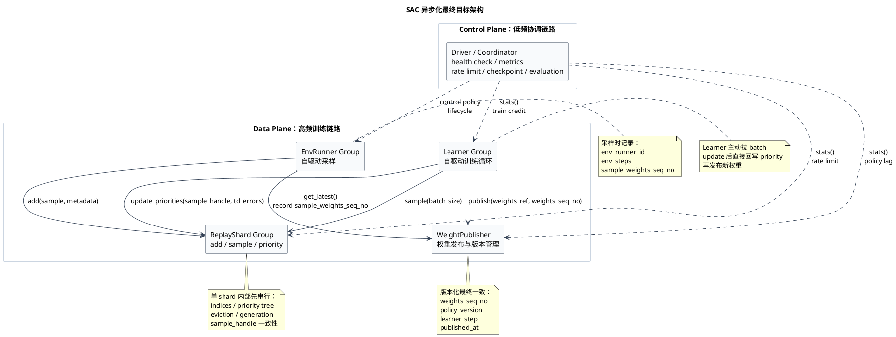

# SAC 训练速度优化技术分享提纲

这次分享聚焦一个问题：在 RLlib new API stack 下，SAC/DQN 的默认 off-policy 训练链路随着规模变大，Driver 会同时承担采样调度、ReplayBuffer 操作、Learner 调度、priority 回写和权重同步，逐渐成为中心瓶颈。

分享主线是：先说明默认同步流程，再用 timer 定位瓶颈，随后按照“先纵向优化、再异步解耦、最后横向扩展”的路径，把系统一步一步演进到 EnvRunner、ReplayBuffer、Learner、WeightPublisher 各自自驱动的目标架构。

核心观点：

- 不要一开始就上复杂异步架构，先用 timer 和 metrics 证明瓶颈在哪里；
- 先优化单条同步链路里的固定开销和模块内部性能，再拆异步；
- 异步化要分阶段推进：先采样异步，再 Learner 异步，再 ReplayBuffer actor 化；
- Driver 最终应退出高频 data plane，只保留低频 control plane；
- ReplayBuffer、Learner、WeightPublisher 可以独立演进，但接口、版本和滞后语义要先定义清楚。

## 1. 当前默认训练流程

RLlib new API stack 下，SAC 复用 DQN 的 off-policy replay buffer 训练路径。默认流程可以简化为：

```text
Driver / Algorithm.training_step()
  -> synchronous_parallel_sample()
  -> local_replay_buffer.add(episodes)
  -> local_replay_buffer.sample(batch)
  -> learner_group.update(batch)
  -> update_priorities_in_replay_buffer(td_errors)
  -> env_runner_group.sync_weights()
  -> report metrics
```

这个流程里，EnvRunner、ReplayBuffer、Learner 都可以被看成相对独立的模块，但训练节奏仍主要由 Driver 串起来。

默认职责：

- `Driver`：训练主循环，拉样本、写 replay、sample batch、调 Learner、更新 priority、同步权重并聚合指标；
- `EnvRunner`：管理一个或多个 env，负责 rollout 采样；
- `ReplayBuffer`：维护样本池，执行 add、sample、eviction 和 PER priority 相关逻辑；
- `Learner`：执行梯度更新，返回 loss、TD-error 和训练指标；
- `Weight sync`：把 Learner 更新后的模型参数同步到 EnvRunner。

默认架构的优点是语义简单：sample、replay、Learner、priority update、weight sync 都在一个顺序路径里，TD-error 和 priority 天然容易对齐。

默认架构的问题也很直接：随着 env 数量、Learner 数量和 batch 量上升，Driver 会同时承担 control plane 和 data plane。它既要做低频协调，也要处理高频数据搬运和 RPC 调度，容易成为中心瓶颈。

## 2. 先打点：不要先猜瓶颈

优化第一步不是改架构，而是补 timer 和 metrics。先确认当前慢在哪里，再决定要优化哪一段。

需要观测：

- `sample_time`：EnvRunner 采样耗时；
- `replay_add_time`：样本写入 replay 耗时；
- `replay_sample_time`：从 replay 组 batch 耗时；
- `learner_update_time`：训练耗时；
- `priority_update_time`：TD-error 回写 priority 耗时；
- `weight_sync_time`：权重同步耗时；
- `driver_step_time`：每个 training step 的总耗时；
- `queue_depth` / `inflight_requests`：异步化后各队列和 RPC 的积压情况；
- `policy_lag` / `batch_staleness`：样本使用的权重版本和 Learner 当前版本之间的滞后。

判断口径：

- `learner_update_time / driver_step_time` 高：优先看 Learner、GPU 利用率、CPU 到 GPU 拷贝和 optimizer step；
- `sample_time` 高或波动大：优先看 EnvRunner straggler、env step、connector 和 metrics 统计；
- `replay_add_time` 或 `replay_sample_time` 高：优先看 ReplayBuffer 数据结构、对象拷贝、Python loop、eviction 和 PER 维护；
- Driver CPU 高但 Learner/GPU 空：Driver 很可能在高频 data plane 或 RPC 调度上成为瓶颈；
- queue 长期增长：生产和消费速率不匹配，需要限流、丢弃过期结果或扩 shard。

这一步的目标，是把“感觉慢”变成可定位的耗时分布。后面每一步优化，都应该能在这些指标上看到变化。

## 3. 痛点一：小 batch / 小 fragment 放大固定开销

### 问题

当 `rollout_fragment_length` 很小、batch 很小的时候，每条样本摊到的固定开销会变高。环境本身可能很轻，但 RPC、metrics、replay bookkeeping、checkpoint/logging 会占掉大量时间。

### 现象

- 环境很轻，但训练吞吐不高；
- `rollout_fragment_length` 很小；
- 每轮 RPC、metrics、replay bookkeeping、checkpoint/logging 开销占比高；
- Learner/GPU 没有吃满。

### 优化方案

- 调大 `rollout_fragment_length`，降低每条样本摊到的调度和 RPC 固定开销；
- 调整 `train_batch_size`，让 Learner/GPU 的计算更饱满；
- 合理设置 EnvRunner 数量，避免 Driver 被过多小请求打爆；
- 降低过密 evaluation、checkpoint、logging；
- 调整 replay capacity 和 eviction 频率，避免频繁维护存储结构。

这一阶段仍然保持默认同步语义：

```text
Driver
  -> local replay add/sample
  -> sync learner update
  -> sync priority update
  -> sync or interval weight sync
```

阶段边界：只要 ReplayBuffer 还在 Driver 本地，就属于本地性能优化，不算真正的异步 replay 架构。这个阶段的目标是先把单链路上的固定开销压下来。

## 4. 痛点二：单模块内部仍有纵向优化空间

### 问题

在拆 actor、拆 queue、拆 shard 之前，单模块内部可能还有明显的纵向优化空间。此时如果直接异步化，只是把慢点藏到队列后面，不一定能提高真实吞吐。

### 现象

- env step 慢；
- ReplayBuffer 的 add/sample 慢；
- Learner update 慢；
- 模型参数同步慢。

### 优化方案

- Env 侧先区分是环境本身慢，还是 connector、数据转换、metrics 统计慢；
- ReplayBuffer 侧优化 driver-local 的 `add()`、`sample()`、indices、eviction、对象拷贝和 Python loop；
- Learner 侧观察 dataloader、CPU 到 GPU 拷贝、forward/backward、optimizer step 的耗时；
- 权重同步侧观察参数序列化、object store put/get、EnvRunner 端 `load_state()` 的耗时。

目前已经做了一部分 `add()` 函数优化。这类优化仍属于单链路纵向优化：它不改变 SAC 的同步训练语义，但可以降低后续异步化前的基础开销。

阶段边界：先确认单模块内部没有明显低成本优化空间，再进入异步化。否则异步化只会增加系统复杂度。

## 5. 痛点三：同步采样存在 straggler barrier

### 问题

默认 `synchronous_parallel_sample()` 会让 Driver 等一轮采样结果。多个 EnvRunner 虽然并行 rollout，但慢 EnvRunner 会拖住这一轮训练，形成 straggler barrier。

### 现象

- EnvRunner 耗时差异大；
- 快 EnvRunner 经常等待慢 EnvRunner；
- Learner 等数据；
- Driver 在 sample barrier 上花时间。

### 优化方案

先做 bounded async EnvRunner sampling。也就是仍由 Driver 调度 EnvRunner，但不再要求每轮等齐所有 EnvRunner。

```text
Driver
  -> 对每个 EnvRunner 发起有限 in-flight sample 请求
  -> fetch ready episodes/chunks
  -> ready 样本写入 local replay
  -> replay sample
  -> sync learner update
  -> sync priority update
```

关键约束：

- 每个 EnvRunner 的 in-flight sample 请求数必须有上限，避免样本过旧或 object store 压力过大；
- Driver 只消费 ready 的 episodes/chunks，不因为某个慢 EnvRunner 阻塞整轮训练；
- 采样结果要带 `env_runner_id`、`sample_weights_seq_no`、`env_steps` 等 metadata，后面才能统计 straggler 和 policy lag；
- replay 和 Learner 暂时仍保持同步，先只异步采样端，降低一次性改动风险。

阶段边界：这一阶段只消除采样 barrier，不同时改 ReplayBuffer 和 Learner。这样可以保持 replay 和 Learner 语义简单。

## 6. 痛点四：同步 learner.update 阻塞主链路

### 问题

在默认路径里，Driver 取到 batch 后同步调用 `learner.update()`。如果 Learner update 时间长，Driver 就不能继续调度下一轮 sample、replay sample 或 priority update。

### 现象

- `learner_update_time` 占比高；
- Learner/GPU 有空洞或利用率不稳定；
- Driver 等 Learner result；
- sample 和 replay 端已经有数据，但训练链路推进慢。

### 优化方案

把 Learner update 做成有界异步。此时仍可以由 Driver / Coordinator 调度 Learner，但 Learner 的计算不再阻塞 Driver 的整个 training step。

```text
Driver / Coordinator
  -> replay sample
  -> put batch into learner queue_in

Learner
  -> get batch from queue_in
  -> learner.update(batch)
  -> put {sample_handle, td_errors, metrics} into queue_out

Driver / ReplayBuffer
  -> consume learner result
  -> update replay priorities
  -> report metrics
```

关键点是 bounded queue 和结果对齐：

- `queue_in` 不能无限堆积，否则 Learner 会训练过旧 batch；
- Learner 结果不能只返回 `td_errors`，必须带 `sample_handle`；
- `sample_handle` 需要包含 shard、slot/index、generation 等信息，避免 eviction 后 priority 更新错位；
- priority update 可以延迟，但要记录 stale/drop 指标；
- 第一版可以仍由 Driver 消费 `queue_out`，等链路稳定后再让 ReplayBuffer 或 Learner 直接处理 priority update。

阶段边界：这一阶段的目标是让 Learner/GPU 的计算和 Driver 的调度部分重叠起来，但还不急着把所有模块都拆成完全自驱动。

## 7. 痛点五：本地 ReplayBuffer 成为中心瓶颈

### 问题

当 EnvRunner 增多后，样本写入和 replay sample 都集中在 driver-local ReplayBuffer。Driver 不仅要调度，还要处理高频 replay 数据操作。

### 现象

- `replay_add_time` 或 `replay_sample_time` 占比高；
- Driver CPU 长期较高；
- EnvRunner ready samples 积压；
- Learner 等 batch；
- priority update 变慢；
- object store 压力上升。

### 优化方案

把 ReplayBuffer actor 化。第一版可以让 ReplayBuffer 作为一个独立 actor，对外异步、内部串行。

```text
EnvRunner / Driver -> ReplayBuffer.add(sample)
Learner / Driver   -> ReplayBuffer.sample(batch_size)
Learner / Driver   -> ReplayBuffer.update_priorities(sample_handle, td_errors)
```

如果采用入队列/出队列模型，建议把消息类型明确区分：

```text
ReplayBuffer ingress queue:
  SampleAdd {
    episode_or_chunk,
    env_runner_id,
    sample_weights_seq_no,
    env_steps,
  }

  PriorityUpdate {
    sample_handle,
    td_errors,
    learner_id,
    learner_step,
  }
```

ReplayBuffer 内部串行消费：

```text
while running:
    msg = ingress_queue.get()

    if msg.type == "sample_add":
        add_to_storage(msg.episode_or_chunk)

    if msg.type == "priority_update":
        if handle still valid:
            update_priority(msg.sample_handle, msg.td_errors)
        else:
            drop_stale_priority_update()

    maybe_prepare_bounded_ready_batches()
```

为什么内部先串行：

- 保证 replay indices 一致；
- 保证 priority tree 一致；
- 保证 eviction 和 generation 一致；
- 降低 sample handle 错位风险。

阶段边界：这里的重点不是让单个 ReplayBuffer actor 内部变复杂，而是先把 ReplayBuffer 从 Driver 本地挪出来，让 Driver 不再直接承担 replay 的高频数据操作。吞吐不够时，优先通过多 ReplayShard 横向扩展，而不是在单个 shard 内部多线程修改复杂状态。

## 8. 痛点六：Driver 逐 batch 调度 Learner 仍在 data plane 上

### 问题

ReplayBuffer actor 化后，如果仍由 Driver 每次 sample、每次调用 Learner、每次处理 Learner result，Driver 仍在高频 data plane 上。此时系统已经拆出了 ReplayBuffer actor，但训练调度还没有真正从 Driver 身上移走。

### 现象

- Learner/GPU 有空洞；
- Driver 调度 RPC 成为瓶颈；
- 多 Learner 时 Driver 需要处理大量 in-flight 和 result；
- metrics 和 TD-error 回写变复杂。

### 优化方案

让 Learner 进入自驱动训练循环。训练数据由 Learner 自己从 ReplayBuffer 获取，priority 由 Learner 结果直接回写 ReplayBuffer，权重由 Learner 发布到 WeightPublisher。EnvRunner 负责自己的采样，ReplayBuffer 负责自己的 add/sample/update，Learner 负责自己的训练循环。

目标形态：

```text
Learner.train_loop()
  -> ReplayBufferActor.sample(...)
  -> learner.update(batch)
  -> ReplayBufferActor.update_priorities(sample_handle, td_errors)
  -> WeightPublisher.publish(weights_ref, weights_seq_no)
```

这一步之后，Driver 不再逐 batch 调 Learner，只负责低频控制：

- actor lifecycle 和健康检查；
- replay ratio / train credit / rate limit 等控制策略；
- 指标聚合；
- checkpoint 和 evaluation；
- 必要时发布新的 control policy。

阶段边界：这一节是架构演进的核心转折点。Driver 从“每个 batch 都参与”的 data plane 中退出，变成低频 coordinator。

## 9. 痛点七：权重同步 fanout 可能成为独立瓶颈

### 问题

小规模时，Driver 定时把 Learner 权重同步到 EnvRunner 是可以接受的。但 EnvRunner 数量变大后，权重 fanout 本身会成为独立系统问题。

### 优化方案

拆出 `WeightPublisher`。权重同步不追求每次采样强一致，而是用版本化的最终一致语义控制 policy lag。

SAC 主链路只依赖薄接口：

```text
publish(weights_ref, weights_seq_no, metadata)
get_latest(min_seq_no=None)
stats()
```

职责边界：

- `Learner`：发布最新权重引用和版本；
- `WeightPublisher`：保存 latest weights、提供 pull/push、记录版本和同步指标；
- `EnvRunner`：按策略获取权重并更新本地 policy module；
- `Driver / Coordinator`：只决定同步策略和监控 policy lag。

`WeightPublisher` 是独立子系统，后续可以自己优化：

- 单 actor；
- publisher shard；
- 分层广播；
- 节点本地 cache；
- pull-based cache invalidation；
- 增量权重 / delta broadcast；
- 限流和过期控制。

第一版只需要约定版本语义：

- `weights_seq_no`；
- `policy_version`；
- `learner_step`；
- `published_at`；
- 可选的 `module_id` / policy id。

EnvRunner 采样时必须记录自己使用的权重版本：

```text
policy_lag = latest_learner_weights_seq_no - sample_weights_seq_no
```

EnvRunner 不应该默认阻塞等待最新权重。推荐策略是：有新权重就更新，没有新权重就继续采样；只有 policy lag 超阈值时才 backoff 或强制同步。

## 10. 横向扩展：从单 actor 到 shard

纵向链路打通后，再做横向扩展。扩展顺序仍然要由 metrics 决定：样本不够先扩 EnvRunner，ReplayBuffer 成为瓶颈再拆 ReplayShard，GPU 不够再扩 Learner。

### 10.1 扩 EnvRunner

增加 EnvRunner / env 数量，提高样本产出。慢环境可以增加 `num_envs_per_env_runner` 或使用 async vector env。

需要观察：

- sample throughput；
- ready sample queue；
- object store 压力；
- policy lag；
- replay add 压力。

### 10.2 扩 ReplayShard

单个 ReplayBuffer actor 成为瓶颈后，拆成多个 ReplayShard：

```text
shard_id = hash(env_runner_id or episode_id) % num_shards
EnvRunner -> ReplayShard[shard_id].add(...)
```

Learner 采样时可以按 replay size、priority mass 或 assigned shard set 加权选择 shard。

单 shard 内部先保持串行，多 shard 承担吞吐扩展。这样可以把复杂状态限制在 shard 内部，而不是把一个 ReplayBuffer actor 做成复杂多线程共享状态。

### 10.3 扩 Learner / GPU pipeline

当 replay 产出足够多而 Learner/GPU 成为瓶颈时，增加 Learner。

有 GPU 时，可以拆出 CPU 到 GPU 的加载队列：

```text
replay batch queue
  -> cpu_to_gpu queueA
  -> learner ready queueB
  -> learner update
```

多 Learner / 多 GPU 时，`queueA` 和 `queueB` 也要按 Learner 或 device 做 shard，避免单队列成为瓶颈。

需要控制：

- 每个 Learner 的 in-flight batch 数；
- replay ratio / train credit；
- batch stale；
- priority update lag；
- Learner queue 长度；
- GPU 利用率。

## 11. 最终目标架构

最终希望 Driver 只做低频 coordinator，EnvRunner、ReplayShard、Learner、WeightPublisher 各自自驱动。

```text
EnvRunner
  -> sample complete episode / closed chunk
  -> ReplayShard.add(sample, metadata)
  -> maybe WeightPublisher.get_latest()

ReplayShard
  -> accept add
  -> serve sample
  -> update priorities
  -> expose stats

Learner
  -> ReplayShard.sample()
  -> learner.update(batch)
  -> ReplayShard.update_priorities(sample_handle, td_errors)
  -> WeightPublisher.publish(weights_ref, weights_seq_no)

WeightPublisher
  -> hold latest weights_ref
  -> serve EnvRunner pull or optional push
  -> expose sync stats

Driver / Coordinator
  -> collect aggregate metrics
  -> adjust replay ratio / train credit / rate limit
  -> actor lifecycle and health check
  -> checkpoint / evaluation
  -> publish control policy
```

对应的 PlantUML 框架图：



## 12. 落地路线总结

整体落地仍然按当前思路分阶段推进：

1. 补 timer 和 metrics，先确认瓶颈，不靠猜；
2. 优化本地同步链路，包括小 batch、小 fragment、ReplayBuffer add/sample、Learner update 和权重同步；
3. 做 bounded async EnvRunner sampling，先消除采样 straggler barrier；
4. 做 bounded async Learner update，让 Learner/GPU 计算和 Driver 调度重叠；
5. 将 ReplayBuffer actor 化，对外异步、内部串行，保证 handle、priority、eviction 的一致性；
6. 让 Learner 自驱动训练循环，Driver 退出逐 batch data plane；
7. 拆出 WeightPublisher，用版本化最终一致控制权重同步和 policy lag；
8. 根据 metrics 横向扩 EnvRunner、ReplayShard、Learner/GPU pipeline。

最终目标不是一次性把系统改成复杂分布式架构，而是在每一步都保持语义可控、指标可验证、瓶颈可解释。先把同步链路变快，再逐步把高频 data plane 从 Driver 身上拆出去。
